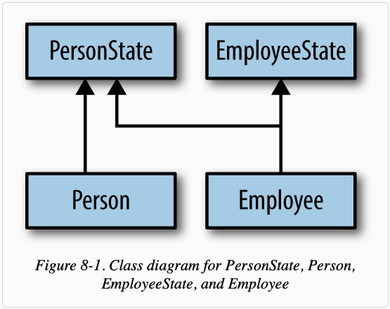
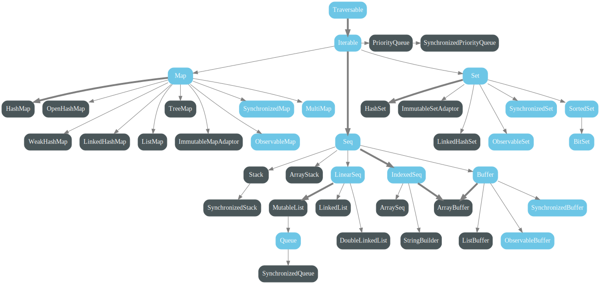

Scala Notes:

__Pattern Matching__
- can match any type
- For list: match Nil, match head +: tail
- Match on tuple
- case match with if
- Match on case class with parameter
- val head +: tail = List(1,2,3)  // head: Int = 1; tail: List[Int] = List(2,3)

__Implicit Arguments__
- only the last argument
- look for things in scope
- read more on official site

__Functional Programming__
- No side effect
- Able to substitute value for an expression
- Higher order function to include function as method parameter
- Pure function & immutable state are the most important concepts
- Efficient copy, by sharing unmodified parts
- map, reduce, fold etc.
- anonymous function, lambda, closure: A function, anonymous or named, that closes over its environment to bind variables in scope to free variables within the function.
- tailrec

__For Yield__
- all but last uses flatMap, but last uses map
- All containers can go through for-yield, e.g. Option, Either
- Validation, Try, Either

__OOP in Scala__
- singleton declared with word object
- Overloading is allowed
- val & def can exist together if method contains parameters
- Value classes with only 1 public val argument
e.g.
class Dollar(val value: Float) extend AnyVal { override def toString = "$%.2f".format(value) }
- Universal trait: 1. derived from Any 2. define only methods 3. no initialization of its own
e.g.
trait Formatter extends Any {
 def format(areaCode: String, exchange: String, subnumber: String): String
 = s"($areaCode) $exchange-$subnumber"
 }
- Parameters without val or var are private values, visible only within the class.
- Primary constructor parameters with val and var are public. However, because vals are immutable, you can’t write the following.
- OOP suggestions
    1. an abstract base class or trait is subclassed 1 level by concrete classes
    1. concrete classes are never subclassed, except classes mixin other behaviors in traits
    1. considering partitioning behavior into traits and mixin those traits: check PersonState implementation in Chapter 8
    1. never split logical state across parent-child type boundaries
    

__Trait__
- for stackable traits, the order with which logic is executed follows the trait order

__Chapter 12: Scala Collections__
- Collection Hierarchy, check image below:

- https://stackoverflow.com/questions/24464792/scala-collections-flowchart/24465514#24465514
- Builder to abstract over construction
- CanBuildFrom to provide implicit factories for constructing suitable Builder instances for a given context
- Like traits add necessary return type
- Miniboxing: related to primitive

__General__
- Methods look like functions, but:
  Methods are defined with the def keyword.
  def is followed by a name, parameter lists,
  a return type, and a body.

You can define classes with the class keyword followed by its name and constructor parameters.

Scala has a special type of class called a “case” class. By default, case classes are immutable
and compared by value. You can define case classes with the case class keywords.

Objects are single instances of their own definitions.
You can think of them as singletons of their own classes.

object IdFactory {
  private var counter = 0
  def create(): Int = {
    counter += 1
    counter
  }
}
val newId: Int = IdFactory.create()
println(newId) // 1
val newerId: Int = IdFactory.create()
println(newerId) // 2
// the above is for object
